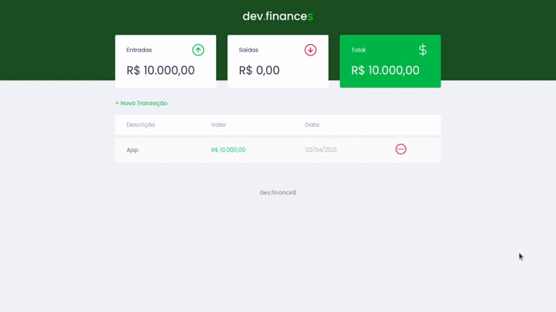

<h1 align="center" style="padding-top: 30px;padding-bottom: 20px;">
    
</h1>

  💰 Uma aplicação web feita na <a href="https://www.youtube.com/watch?v=NlDr6JX3VvA">maratona discover</a>
    que lista nossos gastos financeiros com os somatórios de lucros e despesas.

  
  
  

<h2 style="padding-top: 30px">🖼️ Demonstração<h2>

